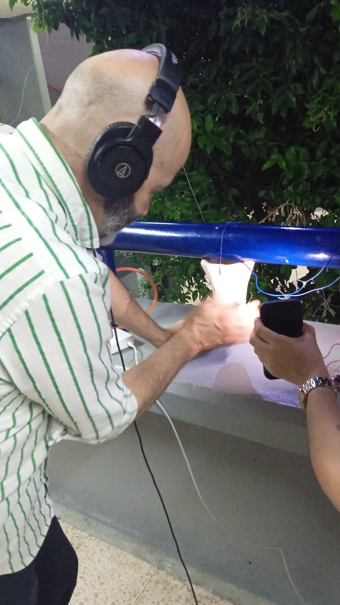

# Sesión 17: Presentación de Instalaciones

_Jueves 29 de Mayo, 2025_

_Lugar: LIMME, Facultad de Música, UNAM_

Se presentaron las instalaciones desarrolladas por lxs participantes del Laboratorio en el
LIMME (Laboratorio de Informática Musical y Música Electroacústica) y los pasillos de la
Facultad de Música.

