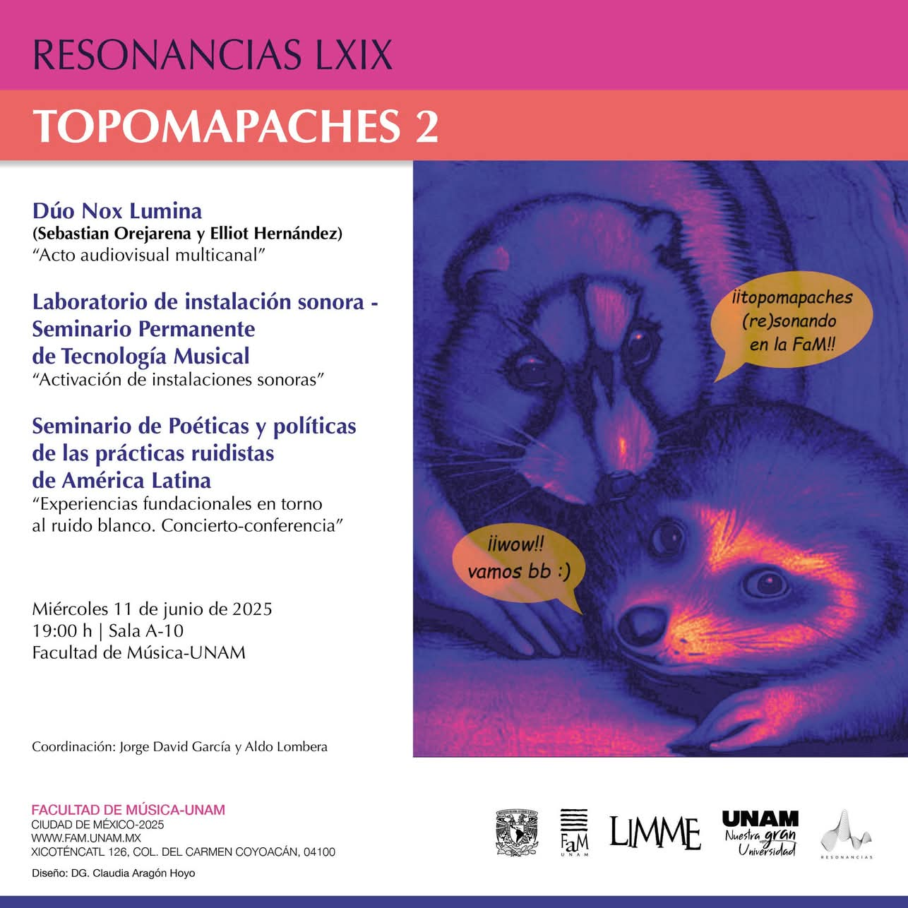

# Sesión 18: Cierre

_Jueves 5 de Junio, 2025_

_Lugar: Zoom_

La sesión inició con la planeación logística para el **concierto de Topomapaches**
en el marco de la serie Resonancias.

## Siguiente instancia del SPTM

El siguiente semestre **el laboratorio continua**
con el objetivo de montar una exposición colectiva con las
instalaciones desarrolladas en un espacio abierto al público.

> El horario será el mismo: Jueves 17:00 hrs.

Este trabajo es complejo e implica diversas disciplinas:
Museografía, curadoría, historeografía, documentación y registro, etc.

De entrada, habrían actividades relacionadas a:

* Invitar a artistas que comenten el trabajo.
* Luces, montaje, configuración del espacio.
* Crear un libro de la instalación (tallereado).
* Registro y documentación de las piezas.

El producto del Laboratorio podría tener diversas formas:

* Una instalación en un espacio físico público.
* Una instalación _digital_ en línea.
* Un material audiovisual con el registro de las piezas y la documentación
del proceso de creación.

**Núcleo para el siguiente semestre**:
Lucía Rodríguez, José Orozco, Homero Guerrero, Jorge David García,
Aketsalli, Karen y Rubiel.

**Interesadxs en concretar sus piezas**, no comprometidos por el momento:
Lu Yang, Marianne Teixido, Giovanni, Pilar

_Se convoca a todxs lxs interesadxs en participar —de cualquier manera y medida—
a asistir a la primera sesión del siguiente semestre._

> Primera sesión: 21 de Agosto
> (o quizás 14 de Agosto si no hay conflicto con el coloquio).

La modalidad será principalmente presencial, pero se harán sesiones híbridas
para coordinar a todxs lxs interesadxs.

## Retrospectiva del Laboratorio

- Jorge David: Fue muy relajante delegar la gestión y coordinación de esta instancia y
tener el espacio para desarrollar mi propia pieza. Me gustó la naturaleza libre y
abierta del laboratorio. Muy bonito ver como se desenvolvió todo, cuando en un inicio
no teníamos una idea clara de para donde iría. El espacio de Nadadoras nos recibió
muy bien e hizo posible esto.
- LuR: Fue muy hermosa la conformación del grupo con personas que
no conocía, con muy diversos trasfondos. Disfruté mucho la diversidad de perfiles.
Hubo mucho respeto durante las sesiones y todo se dio orgánicamente a partir de la
segunda mitad del semestre. Todas piezas son hermosas en su estado actual y tienen
mucho potencial si se siguen desarrollando. Me gusta cuando en un taller emergen
proyectos tan diferentes, lo que índica que cada quién encontró un espacio de expresión.
Gracias a Homero y José. Fue toda una experiencia dirigir esto entre tres personas.
- José: Me gustó que todos los trabajos se desarrollaron de manera honesta
y personal. Ver los procesos de trabajo y desarrollo de cada persona: normalmente
trabajo muy solitario y esto fue un buen cambio. Compartir este proceso fue muy
enriquecedor para mi.
- Homero: El inició fue truculento, había un gran número de gente.
Había dado clases grupales antes, pero a público más joven. Esta fue mi primera
experiencia en llevar un seminario del posgrado. Me permitió imaginar procesos a
los que no habría podido llegar por mi cuenta. También me llevó a investigar y aprender
cosas nuevas. Hubo mucha buena onda. Me emociona el desarrollo que sigan las piezas. Invito a todxs a perseguir este trabajo personal, sacarse las espinitas en el proceso
creativo da sentido a la vida.
- Rubiel: Gracias por abrir las invitación a gente externa de la UNAM. Fue
una gran oportunidad para mi. Fue importante la ayuda que me dieron para aterrizar
el proyecto. Ahora sé que existe el LIMME. Espero poder seguir y buscar nuevos horizontes. Ahora tengo la intención de postularme para el posgrado.
- Aketzalli: Tampoco soy parte de la UNAM. Me permitió experimentar fuera de mi zona
de confort. Me ayudó mucho contar con alternativas y perspectivas distintas para
encontrar como desarrollar mi proyecto. Gracias por el tiempo que dedicaron Lu, José y Homero a esto.
- Marianne: Gracias todxs por el espacio. Estuvo muy chido. En general trabajo más
con materiales intangibles; aterrizar mi trabajo a otro soporte me latió mucho.
Haré lo que pueda para poder continuar y concluir este trabajo. Hay todavía potencial
que explorar en el trabajo de todes.
- LuYang: Gracias a todas y todos. Aprendí mucho e inicié un nuevo camino para trabajar.
- Gio: Gracias todos por el apoyo y buena onda. Recibí muchos consejos y ayuda chida.
El espacio fue muy bonito, y conocer a nuevas personas también.
- Karen: Me la pasé muy bien. Estoy muy emocionada por el próximo semestre. Al final
de este proceso tuve complicaciones en mi vida personal, lo que me impidió concluir la
pieza. Me sorprendió descubrir las cosas que hacen todos, todos son muy agradables. Cada jueves iba muy feliz al laboratorio. Nos vemos pronto.
- Xavier. Fui bastante satelital durante esta instancia del seminario, así
que tengo una impresión muy peculiar de como fue desarrollándose el grupo y el
trabajo. Siempre es grata la llegada de personas externas al SPTM. Creo que esta
es la ocasión que más personas llegaron. No es la primera vez que algunx se motiva
a postularse. Creo esto produce un círculo virtuoso en que las ideas locas y
diferentes, atraen a otras. Este espacio se nutre de eso. Gracias a todxs por llegar hasta este momento.
