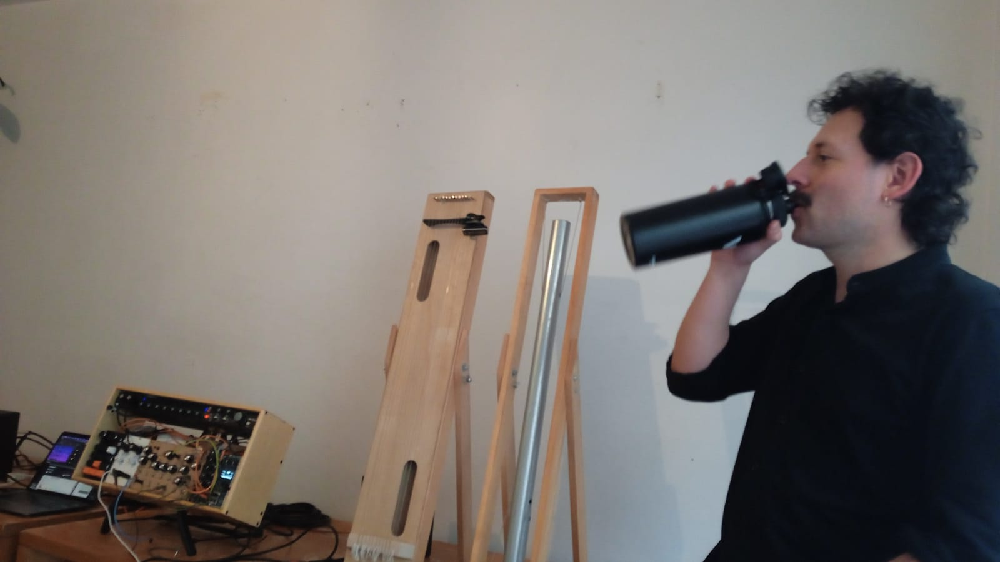
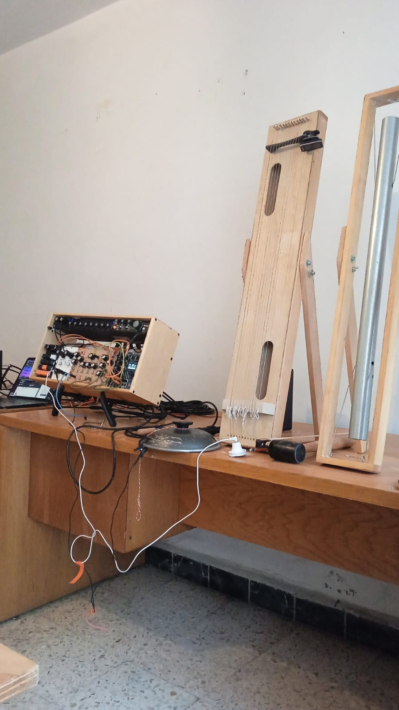
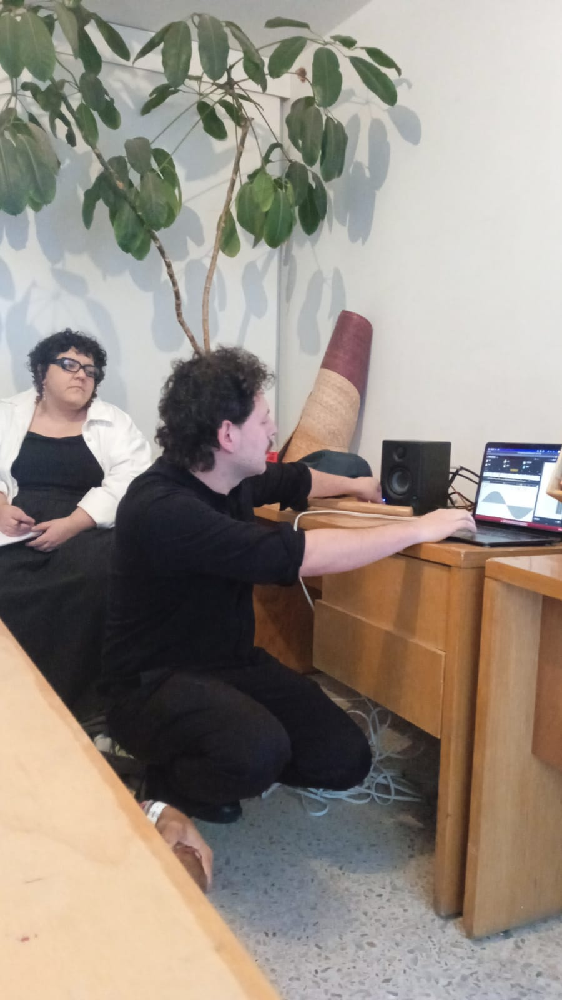
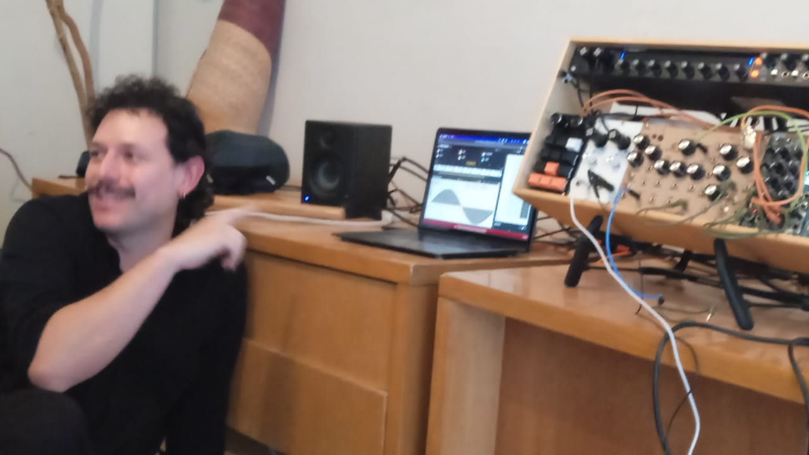
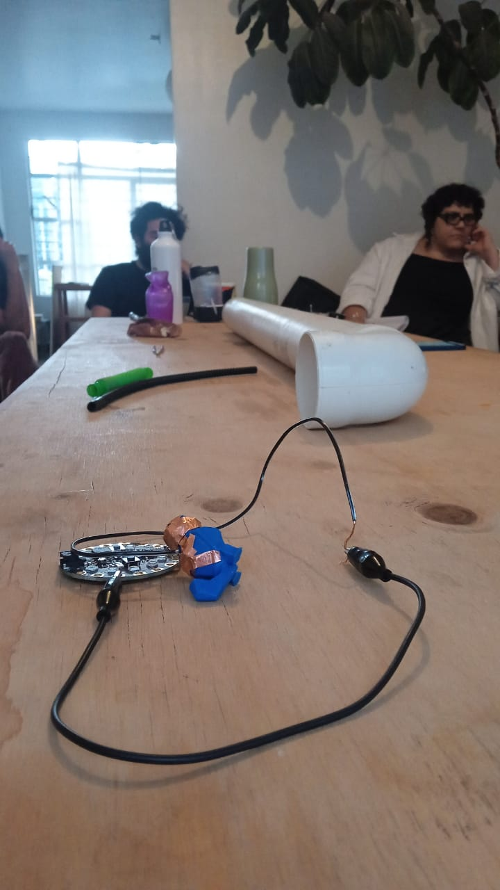

# Sesión 6: Laboratorio de análisis de audio

_Jueves 6 de Marzo, 2025_

_Lugar: Nadadoras30_

Introducción al análisis de audio: elementos de acústica, espectro de frecuencias y
y serie armónica.

Grabamos el sonido de los objetos que llevamos con micrófono de condensador y piezo-eléctrico.
Luego analizamos y comparamos los audios.

